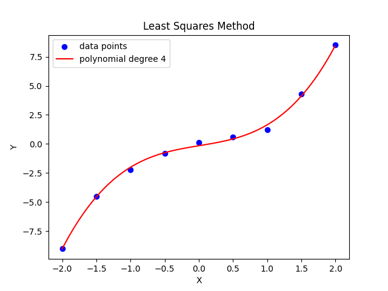
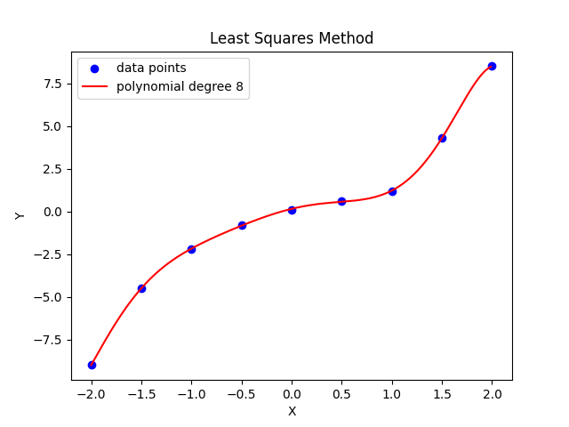

# Least Squares Method (Manual Implementation)

This Python project demonstrates a **hand-written implementation** of the **Least Squares Method** for polynomial curve fitting. It uses **Cholesky decomposition** to solve the normal equations and approximates a set of data points with polynomials of varying degrees.

## 📌 Features

* Implements the Least Squares Method without relying on NumPy or SciPy.
* Uses **Cholesky decomposition** for solving linear systems.
* Plots original data and polynomial approximations using `matplotlib`.
* Written entirely in a single Python file.

## 🧠 How It Works

Given input data points `(X, Y)`, the code:

1. Constructs the normal equations for polynomial fitting.
2. Applies Cholesky decomposition to solve the linear system.
3. Plots the original data and polynomial fits for degrees 2 through *n*.

## 📷 Example Output

### 📈 Degree 2 Polynomial Fit

### 📈 Degree 3 Polynomial Fit

